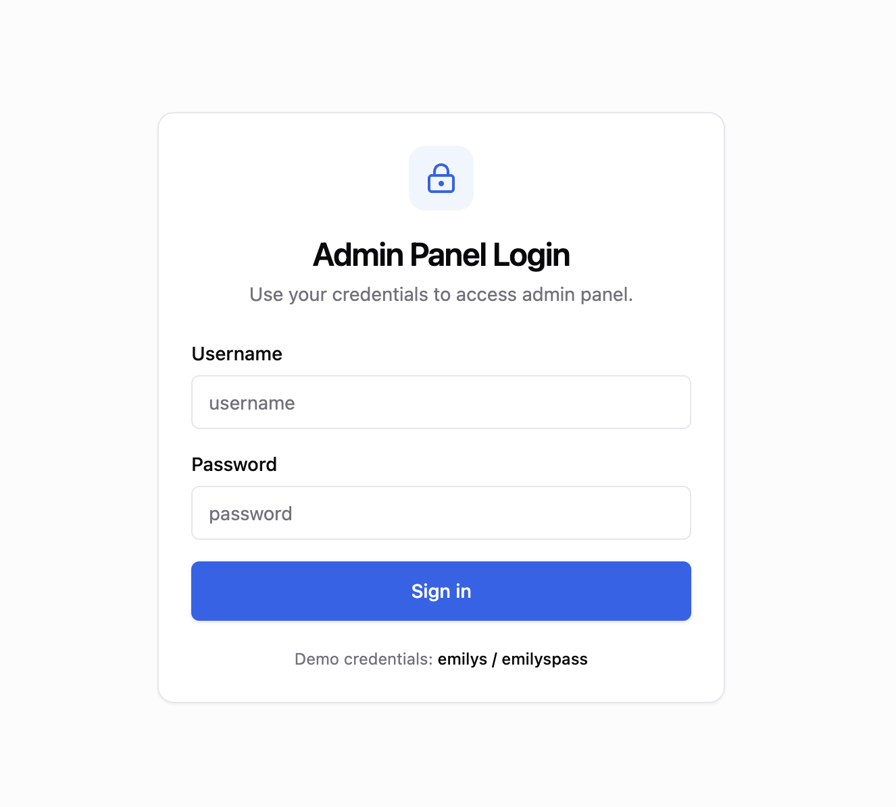
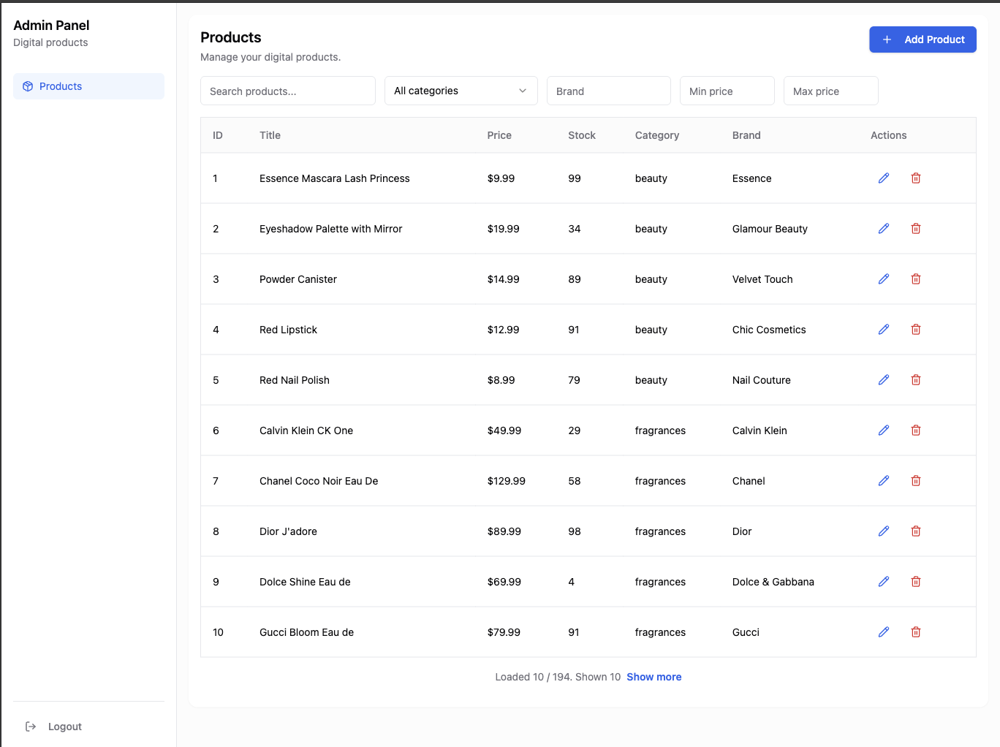
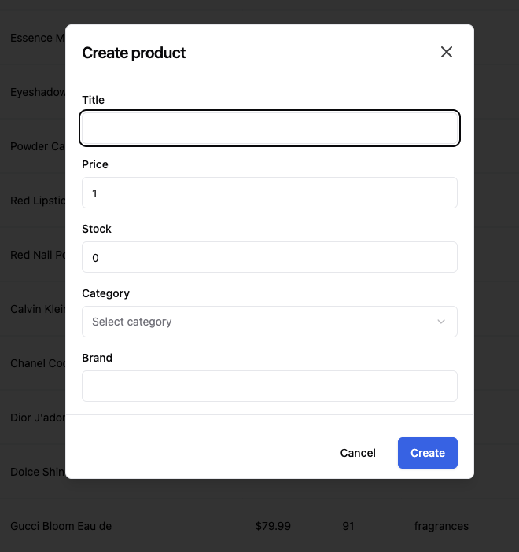

# Simple Admin Dashboard

Frontend test assignment – February 2026

A scalable admin dashboard built with **Feature-Sliced Design (FSD)** and modern React tooling.

---

## Screenshots

### Login Page

### Products Page

### Product Modal

---

## Tech Stack

- Vite
- React 18 + TypeScript
- MobX
- Tailwind CSS
- shadcn/ui (Radix primitives)
- Zod
- react-hook-form
- Feature-Sliced Design

API: https://dummyjson.com/docs

---

## Architecture

The project follows **Feature-Sliced Design (FSD)** principles to ensure scalability and team collaboration readiness.

### Project Structure

    app/        – application bootstrap, providers, router
    pages/      – route-level components
    widgets/    – composite UI blocks (layout, sidebar)
    features/   – isolated business use cases (login, upsert, delete)
    entities/   – domain models (product, session)
    shared/     – reusable UI, api layer, utilities, global state

### Key Decisions

- **Single API entry point** (`shared/api/api-service`)
    - Centralized error handling
    - Authorization header injection
    - Global loading state integration

- **Global UI state (MobX)**
    - Dedicated `uiStore` for app-wide loading indicator
    - Request counter pattern to support parallel requests safely

- **URL as Single Source of Truth**
    - Search
    - Sorting
    - Pagination (`take`, `skip`)
    - Filters (category, brand, price range)

- **Type safety**
    - Strict TypeScript usage
    - Zod schemas for runtime validation

---

## Authentication

- Login via DummyJSON `/user/login`
- Token stored in `sessionStore`
- Authorization header injected centrally in `apiService`
- Protected routes handled via layout
- Logout clears token

---

## Products Module

### Implemented Functionality

- Products table
- Server-side pagination
- Search
- Sorting (title, price)
- Filtering (category, brand, price range)
- Query parameter synchronization
- Incremental loading ("Show more")
- Create product (modal)
- Edit product (modal)
- Delete product (confirmation dialog)

---

## Global Loading Strategy

All API calls go through `apiService`, which:

- Increments a global request counter
- Displays overlay spinner via `uiStore`
- Handles parallel requests correctly (parallel requests do not break loading state)

---

## Responsive Strategy

- Sidebar collapses on mobile
- Filters move to dialog view on smaller screens
- Table supports horizontal scrolling
- Layout remains consistent across breakpoints

---

## Getting Started

Install dependencies:

    npm install

Run dev server:

    npm run dev

Build:

    npm run build

---

## Scalability Considerations

The project is structured to:

- Support additional entities and features without refactoring
- Allow multiple developers to work in parallel (clear layer boundaries)
- Keep domain logic isolated from UI concerns
- Extend easily with RBAC/permissions, tests, and CI
